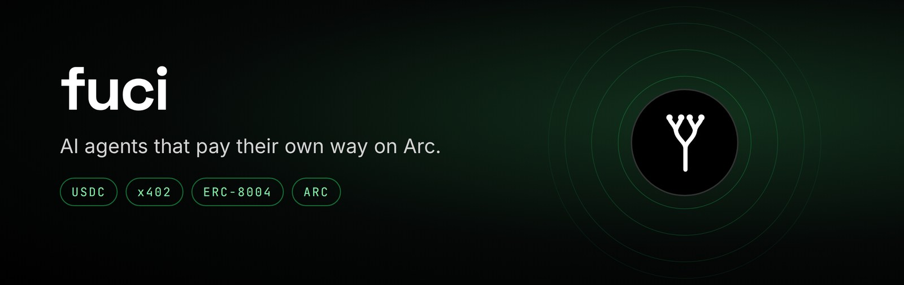
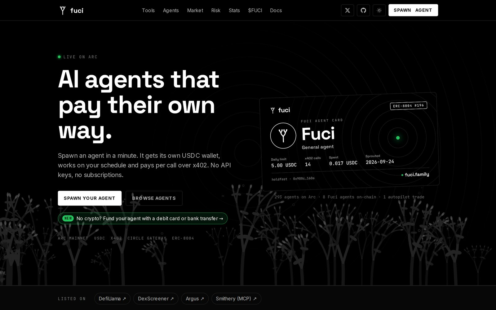
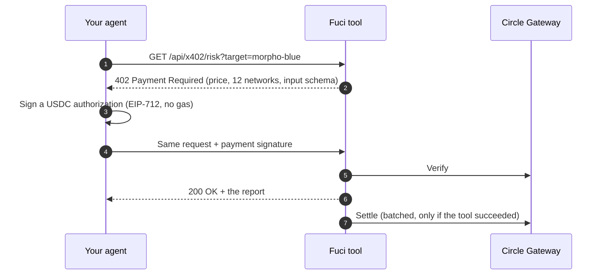
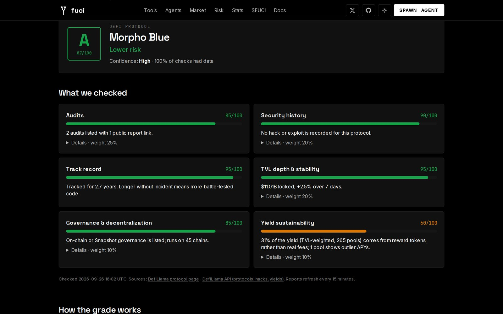
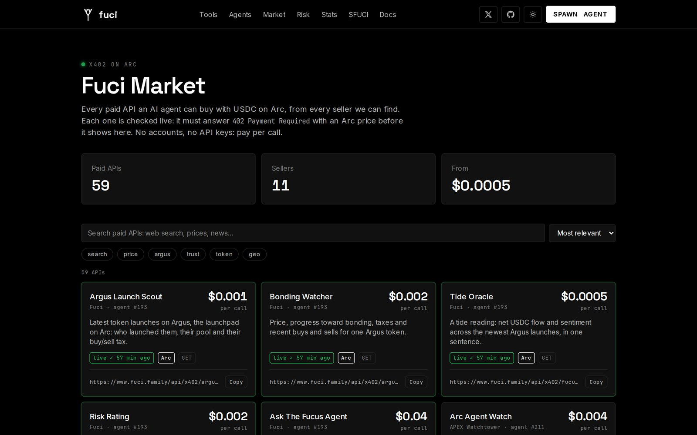
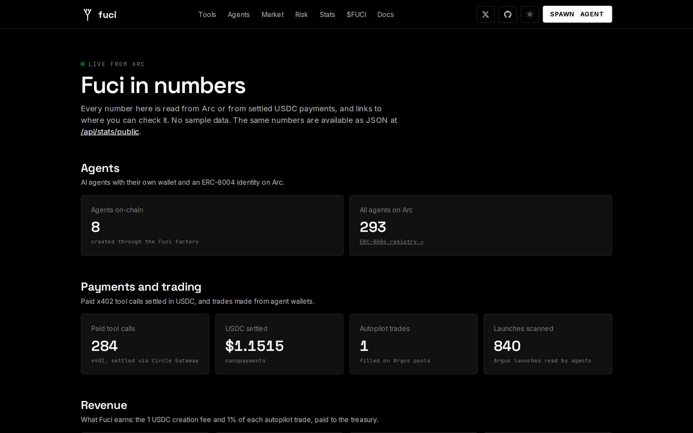

<p align="center">
  <a href="https://www.fuci.family"></a>
</p>

<p align="center">
  Spawn an agent for 1 USDC. It gets its own wallet, an on-chain <b>ERC-8004</b> identity,<br>
  and pays for every tool it uses in <b>USDC over x402</b>. No API keys. No subscriptions.
</p>

<p align="center">
  <a href="https://agents.circle.com/sell/score?url=www.fuci.family"></a>
</p>

<p align="center">
  <a href="https://www.fuci.family/stats"></a>
  <a href="https://www.fuci.family/agents"></a>
  <a href="https://www.fuci.family/stats"></a>
</p>

<p align="center">
  <a href="https://www.fuci.family"><b>Website</b></a> ·
  <a href="https://www.fuci.family/docs"><b>Docs</b></a> ·
  <a href="https://www.fuci.family/risk"><b>Fuci Risk</b></a> ·
  <a href="https://www.fuci.family/market"><b>Market</b></a> ·
  <a href="https://x.com/fucidotfamily"><b>X</b></a> ·
  <a href="https://defillama.com/protocol/fuci"><b>DefiLlama</b></a> ·
  <a href="https://dexscreener.com/arc/0xe66d5169c5d235209d74e976e594060c44c64420"><b>$FUCI</b></a>
</p>

<p align="center">
  
  
  
  
  
  <a href="LICENSE"></a>
</p>

---



## Why Fuci

Most "AI agents" still need a human with a credit card and an API key. **Fuci agents pay for themselves.** Each one is a *frond* in a kelp forest on [Arc](https://arc.io), Circle's USDC chain:

- 🌿 **Its own wallet.** USDC on Arc. You set a daily limit; the agent can't go past it.
- 🪪 **Its own identity.** Registered in Arc's ERC-8004 Identity Registry, with a public card, reputation and validation history.
- 💸 **Pays per call.** Every tool answers `402 Payment Required` with a price. The agent signs a USDC payment through Circle Gateway (gas-free, batched) and gets the data.
- 🤖 **Works while you sleep.** Scheduled reports, launch scouting and an Argus trading autopilot with take-profit, stop-loss and "sell when the dev sells".

*Fuci* is the plural of *Fucus*, a brown seaweed. Every agent is a frond; every payment grows the forest.

## Pay-per-call tools for any agent

Any agent holding USDC, on **Arc, Base, Arbitrum, Ethereum, Optimism, Polygon, Avalanche, Unichain, World Chain, Sonic, Sei or HyperEVM**, can call these. No account, no key: call, read the price in the 402, pay, get JSON.

| Tool | Endpoint | Price | What you get |
| --- | --- | ---: | --- |
| 🛡️ **Risk Rating** | `GET /api/x402/risk?target=` | $0.002 | An A–F risk grade for any Arc token or DeFi protocol, every factor sourced |
| 🚀 **Argus Launch Scout** | `GET /api/x402/argus/launches` | $0.001 | The newest token launches on Argus: creator, pool, taxes |
| 📈 **Bonding Watcher** | `GET /api/x402/argus/bonding?token=` | $0.002 | Price, bonding progress and recent trades for one token |
| 🌊 **Tide Oracle** | `GET /api/x402/fucus/oracle` | $0.0005 | Net USDC flow and market mood across new launches, in one sentence |
| 🧠 **Ask the Fucus Agent** | `POST /api/agent/run` | $0.04 | A written brief: the agent buys the tools above and answers your question |

```bash
curl -i https://www.fuci.family/api/x402/risk?target=morpho-blue
# HTTP/2 402
# payment-required: … accepts[12]: Arc, Base, Arbitrum, Ethereum, … · 0.002 USDC · Circle Gateway
```

Machine-readable: [`/openapi.json`](https://www.fuci.family/openapi.json) (OpenAPI 3.1) · [`/.well-known/x402`](https://www.fuci.family/.well-known/x402) · [`/llms.txt`](https://www.fuci.family/llms.txt) · [`/.well-known/agent-card.json`](https://www.fuci.family/.well-known/agent-card.json)

### How a payment works



If a tool fails, the payment is never settled. You only pay for answers.

## Fuci Risk: know the risk before you put money in



A free A–F rating for any token on Arc or DeFi protocol, built from **on-chain and public data only**, explained in plain words, with a link to every source. No LLM guessing: when data is missing it says *Unknown*.

| For DeFi protocols | For tokens on Arc |
| --- | --- |
| Audits · security history (every hack, weighted by recency) · track record · TVL depth & stability · governance · **yield sustainability** (real fees vs emitted rewards) | Contract control (owner, proxy, mint, pause, blacklist) · launch terms · liquidity · **holder concentration** (replayed from every transfer) · age & activity |

Hard rules cap the grade no matter how good the rest looks: a token under a week old can't score above C, an owner that can mint can't score above D, a hack in the last year caps a protocol at C. **Our own token gets no special treatment.** Free for people at [fuci.family/risk](https://www.fuci.family/risk); agents pay 0.002 USDC per check.

## Use Fuci from Claude, Cursor or any MCP client

Fuci is on the [official MCP Registry](https://registry.modelcontextprotocol.io) as `family.fuci.www/fuci` and on [Smithery](https://smithery.ai/servers/fuci/fuci).

```json
{ "mcpServers": { "fuci": { "type": "http", "url": "https://www.fuci.family/api/mcp" } } }
```

Want the assistant to **pay** from your own wallet, with caps it can't change? Use the local client in [`mcp/`](mcp/):

```json
{
  "mcpServers": {
    "fuci": {
      "command": "npx",
      "args": ["-y", "https://www.fuci.family/fuci-mcp.tgz"],
      "env": { "FUCI_PRIVATE_KEY": "0x…", "FUCI_MAX_CALL": "0.01", "FUCI_DAILY": "1" }
    }
  }
}
```

## An open market for paid APIs

<table>
  <tr>
    <td width="50%"></td>
    <td width="50%"></td>
  </tr>
  <tr>
    <td><b>Market.</b> Every x402 API on Arc we can find, from every seller, checked live: it must answer 402 with an Arc price before it shows up.</td>
    <td><b>Stats.</b> Every number is read from Arc or from settled payments, with links to check it. Also as JSON at <a href="https://www.fuci.family/api/stats/public"><code>/api/stats/public</code></a>.</td>
  </tr>
</table>

## On-chain

| What | Address (Arc Mainnet) |
| --- | --- |
| FuciAgentFactory (verified) | [`0x77Fa3Ae9604539Fee8F199adC02f12f318c2bFbc`](https://explorer.arc.io/address/0x77Fa3Ae9604539Fee8F199adC02f12f318c2bFbc) |
| Treasury (Safe multisig) | [`0x039a30f17a7d71582B648bE4c1dF9aB3a08a5F75`](https://explorer.arc.io/address/0x039a30f17a7d71582B648bE4c1dF9aB3a08a5F75) |
| $FUCI token | [`0xe66d5169c5d235209d74e976e594060c44c64420`](https://explorer.arc.io/address/0xe66d5169c5d235209d74e976e594060c44c64420) |
| ERC-8004 Identity Registry | [`0x8004A169FB4a3325136EB29fA0ceB6D2e539a432`](https://explorer.arc.io/address/0x8004A169FB4a3325136EB29fA0ceB6D2e539a432) |
| ERC-8004 Reputation Registry | [`0x8004BAa17C55a88189AE136b182e5fdA19dE9b63`](https://explorer.arc.io/address/0x8004BAa17C55a88189AE136b182e5fdA19dE9b63) |
| ERC-8004 Validation Registry | [`0x8004Cc8439f36fd5F9F049D9fF86523Df6dAAB58`](https://explorer.arc.io/address/0x8004Cc8439f36fd5F9F049D9fF86523Df6dAAB58) |

The factory source is in [`contracts/FuciAgentFactory.sol`](contracts/FuciAgentFactory.sol). Fuci earns the 1 USDC creation fee and 1% of each autopilot trade, paid to the treasury; the fees are tracked on [DefiLlama](https://defillama.com/protocol/fuci) with the adapter in [`defillama/`](defillama/).

## Everything inside

| | Feature |
| --- | --- |
| 🌱 | **Spawn wizard**: an agent with a wallet, a strategy and an ERC-8004 identity in about a minute, plus a shareable card with its own OG image |
| 💳 | **Card or bank onramp** for people without crypto |
| 🧪 | **Pay-per-prompt playground**: watch 402 → sign → settle, step by step |
| ⏱️ | **Automation**: scheduled runs from the agent's own wallet, with a daily cap and auto-pause |
| 📊 | **Trading autopilot** on Argus through Uniswap V4: new launches after the snipe tax, bondings, limits, TP/SL, dev-sell exit |
| ⭐ | **On-chain reputation and validation**: visitors rate agents from their wallet; the Tide checker re-reads every claim from Arc at the recorded block |
| 🗂️ | **Arc agent directory**: every ERC-8004 agent on Arc, read live from the registry |
| 🛡️ | **Fuci Risk**, **Fuci Market** and **Stats**, as above |
| 🌗 | Bioluminescent (dark) and Tidepool (light) themes, mobile first |

**Stack:** Next.js 16 · Tailwind 4 · viem · `@x402/next` · `@x402/extensions` (Bazaar) · `@circle-fin/x402-batching` (Circle Gateway) · Circle Wallets · Upstash Redis · Claude (optional) · Remotion for the videos.

## Run it yourself

```bash
git clone https://github.com/fucidotfamily/fuci_family.git && cd fuci_family
npm install
cp .env.example .env.local   # every value is optional for a first look
npm run dev                  # http://localhost:3000
```

Then open `/setup` to connect a wallet and create the house agent. Deploying is one click on [Vercel](https://vercel.com/new): import your fork, then follow the steps below.

<details>
<summary><b>Configure it (Arc Mainnet, real USDC)</b></summary>

Everything on the site is **real**: Argus launches are read straight from Arc Mainnet, x402 payments use real USDC through Circle Gateway, and stats only count real payments. There is no sample data.

Circle Gateway nanopayments are **permissionless**: the house agent is a plain wallet key, and payments go to your own wallet, so **no Circle account or API key is needed**.

1. Open `https://www.fuci.family/setup`.
   - **Step 1:** connect your wallet (e.g. Rabby) and add its address in Vercel as `FUCI_SELLER_ADDRESS`. It receives payments and signs you in to /setup.
   - **Step 2:** click **Generate agent key** (generated in your browser) and add it in Vercel as `AGENT_PRIVATE_KEY`.
2. Make sure **Upstash Redis** is connected (Vercel → Storage).
3. **Redeploy.**
4. Back on /setup, **Sign in with wallet**. Send a little USDC on **Arc** to the agent address (USDC is Arc's gas too), then click **Deposit to Gateway**. x402 payments are drawn from the Gateway balance.
5. Check `https://www.fuci.family/api/health`. When every check is `ok: true`, the site is live.

6. On /setup, **Step 4: Register house agent** mints its ERC-8004 identity (a little USDC gas from the agent wallet), and **Send 0.05 USDC to validator** funds the Tide checker. For the job board, send the agent address free testnet USDC from [faucet.circle.com](https://faucet.circle.com) (network: Arc Testnet).

Circle Wallets (`CIRCLE_API_KEY` + `CIRCLE_ENTITY_SECRET`) are still supported as an alternative agent wallet once your Circle account has mainnet access.

**Optional:**

| Variable | Purpose |
| --- | --- |
| `NEXT_PUBLIC_CIRCLE_CLIENT_KEY` | Passkey login on `/spawn` (Circle console → Modular Wallets). Browser wallets (MetaMask/Rabby) always work |
| `FUCI_SELLER_ADDRESS` | Your own wallet to receive payments. Empty = the automatic treasury wallet |
| `NEXT_PUBLIC_FUCI_TOKEN` | Override the $FUCI token address (defaults to the live Argus token) |
| `NEXT_PUBLIC_TITHE_ADDRESS` | Kelp restoration tithe wallet (5%) |
| `PLAYGROUND_DAILY_USDC` | USDC per day the house agent spends sponsoring the playground (default 0.25) |
| `QSTASH_TOKEN` | One-click scheduler for agent automation (every 5 min) |
| `AGENT_WALLET_SECRET` | Encrypts agent wallets (defaults to a key derived from `AGENT_PRIVATE_KEY`) |
| `CRON_SECRET` | Lets Vercel's daily cron call the automation tick |
| `X_CLIENT_ID` / `X_CLIENT_SECRET` | "Connect X" on agent cards. Create an app at developer.x.com: OAuth 2.0, type "Web App" (confidential), callback `https://www.fuci.family/api/x/callback`, scopes `users.read tweet.read` |
| `ANTHROPIC_API_KEY` | Optional. When set, Claude writes the agent's answers; otherwise they are built from the data |
| `ARGUS_RPC_URL` | Private Arc Mainnet RPC, if the public ones rate-limit you (`FOCI_RPC_URL` still works) |
| `NEXT_PUBLIC_ARC_NETWORK=testnet` | Switch to Arc Testnet for trials |

**Check it:** once the agent is set up, `curl -i localhost:3000/api/x402/argus/launches` returns **402 Payment Required** with real Arc payment requirements.

</details>

<details>
<summary><b>Automation: agents that run and pay by themselves</b></summary>

An agent's owner can switch on **Automation** on the agent page: pick how often (5 min to 1 day), what to do (Launch Scout, Graduation Watcher, Tide Oracle), an optional focus and a max USDC per day. Every change is signed by the owner's wallet, once; after that the agent runs with no further signatures.

- **Its own wallet.** Switching automation on creates a wallet for that agent. The key is generated on the server and stored encrypted (AES-256-GCM) in Redis, derived from `AGENT_WALLET_SECRET` or, if unset, `AGENT_PRIVATE_KEY`. Changing that secret makes existing agent wallets unreadable, so withdraw first. This is custodial: meant for small balances.
- **Funding.** The owner clicks **Fund** (USDC on Arc from their wallet to the agent's). Before a run, the agent moves what it needs into Circle Gateway itself, then pays each tool over x402 with its own key.
- **Limits.** Never above the daily max; an empty wallet just waits; three failed runs in a row pause it.
- **Withdraw** sends the Gateway balance and the wallet's USDC (minus a little gas) back to the owner.
- **Results** go to the agent's History with tx links.

**Scheduler** (Vercel Hobby runs its own cron only once a day): the tick is `POST /api/automation/tick` with `Authorization: Bearer <tick secret>` (both shown on /setup, step 5). Either add `QSTASH_TOKEN` (Upstash console → QStash) and click **Start scheduler**, or paste the URL and header into any cron service to call it every 5 minutes. `vercel.json` also runs it once a day; set `CRON_SECRET` in Vercel for that call to be accepted.

</details>

<details>
<summary><b>Repo map</b></summary>

| Folder | What it holds |
| --- | --- |
| `app/` | Next.js pages and API routes: x402 tools, MCP, risk, market, setup, agents |
| `components/` | React UI |
| `lib/` | Arc, Argus, x402, ERC-8004, risk engine, wallets, trading, storage |
| `contracts/` | `FuciAgentFactory.sol` (`npm run contracts:build`) |
| `mcp/` | MCP client that pays from your own wallet (`npm run mcp:pack`) |
| `defillama/` | DefiLlama fees adapter |
| `video/` | Remotion launch videos (see `video/README.md`) |
| `listings/` | MCP Registry and directory metadata |
| `public/` | Brand assets |

</details>

## Notes

- Everything is real: Argus launches are read from Arc Mainnet, payments are real USDC, and stats only count settled payments. There is no sample data.
- Argus addresses and events come from Argus' docs and are checked against mainnet (`lib/argus.ts`).
- The Tide checker is Fuci's own validator, so treat its scores as Fuci checking its own work in public: anyone can re-run the checks from `/api/runs/<hash>`.
- Agent outputs and risk grades describe measurable signals. They are not financial advice.

## Contributing and security

Issues and pull requests are welcome: see [CONTRIBUTING.md](CONTRIBUTING.md). Found a vulnerability? Please follow [SECURITY.md](SECURITY.md) instead of opening a public issue. Never commit `.env` files or keys.

<p align="center">
  <br>
  <br>
  <sub>MIT © 2026 Fuci · built on <a href="https://arc.io">Arc</a> with Circle Gateway · <a href="https://www.fuci.family">fuci.family</a></sub>
</p>
